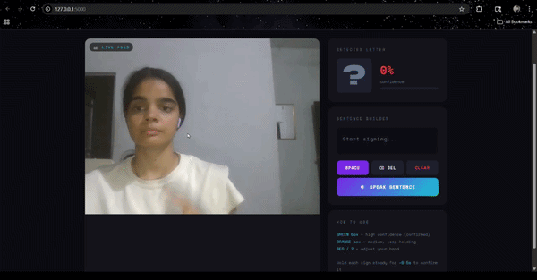

# SanketAI 🤟

> Real-time ASL Sign Language Recognition — powered by MediaPipe + Random Forest, served as a Flask web app.



---

## What it does

SanketAI detects American Sign Language (ASL) hand signs through your webcam and converts them into text in real time. Show a letter, hold it steady for half a second, and it appears in the sentence builder. Press Speak and the sentence is read aloud.

- Recognises all **26 ASL letters (A–Z)**
- **88%+ confidence** on clear signs after wrist-relative normalization
- Runs entirely in the **browser** via a Flask web server
- **Text-to-speech** reads your built sentence aloud
- Color-coded confidence: 🟢 Green = confirmed, 🟠 Orange = hold steady, 🔴 Red = adjust hand

---

## Demo

| Detected Letter | Sentence Builder | Confidence |
|---|---|---|
| Live webcam feed | Letters accumulate automatically | Color-coded 0–100% bar |

---

## Tech Stack

| Layer | Technology |
|---|---|
| Hand Detection | MediaPipe Hands (21 landmarks) |
| ML Model | Random Forest (300 trees, scikit-learn) |
| Normalization | Wrist-relative coordinate normalization |
| Smoothing | 7-frame rolling probability average |
| Backend | Flask (Python) |
| Frontend | HTML + CSS + Vanilla JS |
| Text-to-Speech | Web Speech API (browser-native) |

---

## Project Structure

```
SanketAI/
├── app.py                  # Flask server — streams webcam, runs model
├── collect_landmarks.py    # Stage 1 — collect training data via webcam
├── train_model.py          # Stage 2 — train Random Forest on landmark CSV
├── main.py                 # Stage 3 — standalone desktop recognizer
├── templates/
│   └── index.html          # Web UI — camera feed + sentence builder
├── Model/
│   ├── asl_model.pkl       # Trained Random Forest (300 trees)
│   └── label_encoder.pkl   # Label encoder (A–Z mapping)
└── requirements.txt
```

---

## How It Works

```
Webcam Frame
    ↓
MediaPipe Hands
    → 21 hand landmarks (x, y, z)
    ↓
Wrist-relative normalization
    → subtract wrist coords from all points
    ↓
7-frame probability smoothing
    → average last 7 predictions
    ↓
Random Forest (300 trees)
    → predict letter + confidence
    ↓
15-frame stability buffer
    → confirm letter only when consistent
    ↓
Sentence Builder + Text-to-Speech
```

---

## Setup & Run

**1. Clone the repo**
```bash
git clone https://github.com/Priya220105/SanketAI.git
cd SanketAI
```

**2. Create virtual environment**
```bash
python -m venv venv
venv\Scripts\activate      # Windows
source venv/bin/activate   # Mac/Linux
```

**3. Install dependencies**
```bash
pip install -r requirements.txt
```

**4. Run the Flask app**
```bash
python app.py
```

**5. Open in browser**
```
http://127.0.0.1:5000
```

---

## Train Your Own Model

If you want to collect your own hand data and retrain:

```bash
# Stage 1 — collect landmarks (100-150 saves per letter)
python collect_landmarks.py

# Stage 2 — train the model
python train_model.py

# Stage 3 — run the web app
python app.py
```

---

## Requirements

```
flask
opencv-python
mediapipe==0.10.9
scikit-learn
pandas
joblib
numpy
pyttsx3
```

> **Note:** mediapipe 0.10.9 is required for Python 3.9 compatibility.

---

## Results

| Metric | Value |
|---|---|
| Training samples | 5,608 |
| Test samples | 1,402 |
| Test accuracy | 100% (on collected data) |
| Live confidence | 75–95% on clear signs |
| Letters supported | A–Z (26 classes) |

---

## Future Plans

- [ ] Deploy to cloud (browser-side inference with TensorFlow.js)
- [ ] Word-level recognition using sequence modeling
- [ ] Support for Indian Sign Language (ISL)
- [ ] Mobile-responsive UI

---

## Author

**Priya** — [@Priya220105](https://github.com/Priya220105)

Built from scratch: data collection → model training → Flask deployment.

---

*SanketAI — Breaking communication barriers one sign at a time* 🤟
